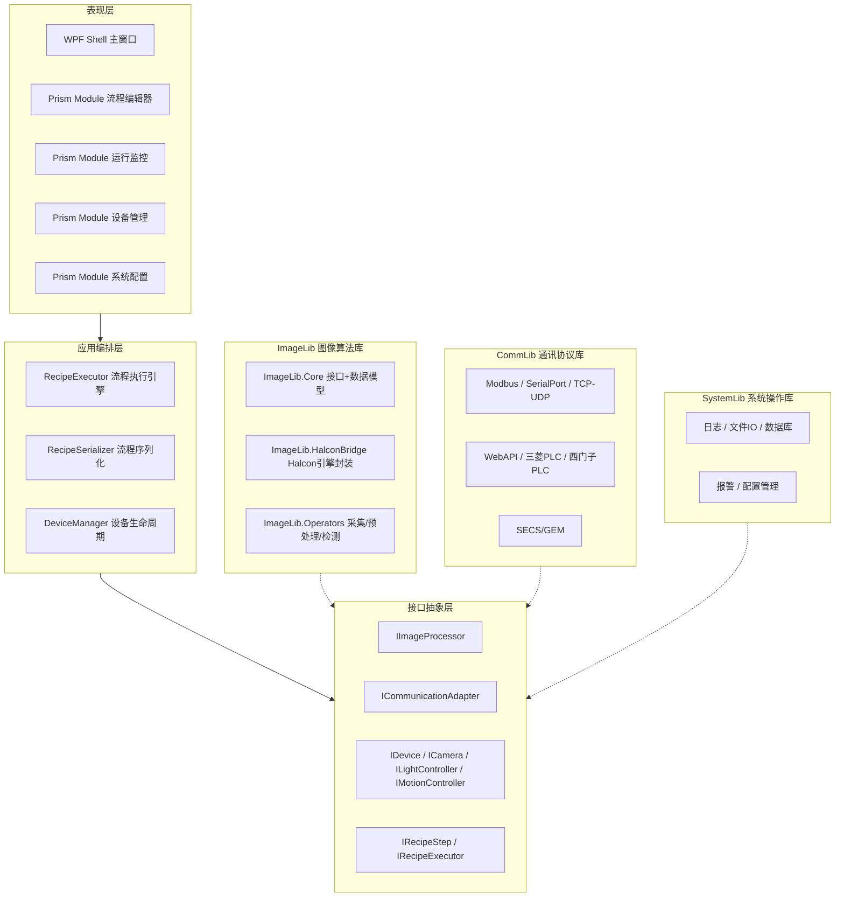

# VisionInspect — 通用视觉检测平台

面向半导体芯片检测行业的通用视觉检测平台。基于 WPF + Prism + Halcon，提供图像处理算子库、多协议通讯库、设备管理、可配置检测流程编排和系统操作服务。

---

## 架构全景



---

## 技术栈

| 层级 | 技术 |
|------|------|
| 框架 | .NET 6.0 / 8.0 |
| 桌面 | WPF + Prism 8.x (DryIoc) |
| 图像 | Halcon 22.x (HalconBridge) |
| 通讯 | Modbus TCP、串口、TCP/UDP、WebAPI、三菱/西门子 PLC、SECS/GEM |
| 数据库 | SQLite (Microsoft.Data.Sqlite) |
| 日志 | NLog |
| 序列化 | Newtonsoft.Json |
| 测试 | xUnit + Moq + FluentAssertions |

---

## 项目结构

```
VisionInspect.sln (18 个项目)
├── src/
│   ├── ImageLib.Core          图像处理核心接口与数据模型
│   ├── ImageLib.HalconBridge   Halcon 引擎封装
│   ├── ImageLib.Operators      采集 / 灰度化 / Blob 分析算子
│   ├── CommLib.Core            通讯核心接口
│   ├── CommLib.Modbus          Modbus TCP 适配器
│   ├── CommLib.SerialPort      串口通讯适配器
│   ├── CommLib.TcpUdp          TCP/UDP 适配器
│   ├── CommLib.WebApi          WebAPI 适配器
│   ├── CommLib.PLC.Mitsubishi  三菱 PLC 适配器
│   ├── CommLib.PLC.Siemens     西门子 PLC 适配器
│   ├── CommLib.SecsGem         SECS/GEM 适配器
│   ├── SystemLib.Core          系统操作接口
│   ├── SystemLib.Services      日志 / 文件 / 配置 / 报警 / 数据库服务
│   ├── WorkflowEngine.Core     流程引擎核心
│   └── App.Wpf                 WPF 主程序 (Prism + MVVM)
├── tests/
│   ├── ImageLib.Tests          22 项
│   ├── CommLib.Tests           8 项
│   ├── SystemLib.Tests         19 项
│   └── WorkflowEngine.Tests    15 项
└── docs/
    ├── stages/                 各阶段文档
    ├── templates/              开发 / 测试 / 发布模板
    ├── 软件方案设计书.md
    ├── 软件架构可视化文档.md
    └── 新项目启动Prompt.md
```

---

## 构建

### 前置条件

- .NET 6.0 SDK / .NET 8.0 SDK
- Visual Studio 2022（或 `dotnet CLI`）
- Halcon 22.x Runtime（仅 ImageLib.HalconBridge 依赖）

### 命令行

```bash
# 还原依赖
dotnet restore VisionInspect.sln

# Debug 构建
dotnet build VisionInspect.sln -c Debug

# Release 构建
dotnet build VisionInspect.sln -c Release

# 运行测试
dotnet test VisionInspect.sln
```

### Visual Studio

1. 打开 `VisionInspect.sln`
2. 选择 `Debug | Any CPU`
3. 生成 → 生成解决方案（Ctrl+Shift+B）

---

## 测试

```
共计 64 项单元测试，全部通过，0 错误
```

| 测试项目 | 数量 | 覆盖范围 |
|----------|------|----------|
| ImageLib.Tests | 22 | 算子执行、图像数据模型 |
| CommLib.Tests | 8 | 串口 / Modbus 适配器 |
| SystemLib.Tests | 19 | 日志 / 配置 / 数据库 / 报警 |
| WorkflowEngine.Tests | 15 | 流程引擎 / 序列化 |

```bash
dotnet test VisionInspect.sln --logger "console;verbosity=normal"
```

---

## 快速开始

1. 克隆仓库后，用 Visual Studio 打开 `VisionInspect.sln`
2. 将 `App.Wpf` 设为启动项目，F5 运行
3. 加载示例流程文件 `demo_recipe.json`：
   - 采集图像 → 灰度化 → Blob 分析 → 输出缺陷数量

示例流程片段：

```json
{
  "id": "demo_001",
  "name": "演示流程-芯片缺陷检测",
  "steps": [
    { "type": "ImageAcquisition",  "processorType": "Acquisition" },
    { "type": "Inspection",        "processorType": "GrayScale" },
    { "type": "Inspection",        "processorType": "BlobAnalysis",
      "parameters": { "MinArea": 100, "Threshold": 128 } }
  ]
}
```

---

## 开发阶段

| 阶段 | 名称 | 状态 |
|------|------|------|
| 第一阶段 | 地基（第 1-4 周） | ✅ 已完成 |
| 第二阶段 | 能用（第 5-10 周） | 🔄 进行中 |
| 第三阶段 | 稳定（第 11-16 周） | ⬜ 待开始 |
| 第四阶段 | 扩展（第 17 周起） | ⬜ 待开始 |

---

## 文档索引

| 文档 | 路径 |
|------|------|
| 软件方案设计书 | [docs/软件方案设计书.md](docs/软件方案设计书.md) |
| 架构可视化文档 | [docs/软件架构可视化文档.md](docs/软件架构可视化文档.md) |
| 新项目启动 Prompt | [docs/新项目启动Prompt.md](docs/新项目启动Prompt.md) |
| 开发进度记录 | [docs/开发进度记录.md](docs/开发进度记录.md) |
| 接口定义规范 | [docs/stages/01-项目启动/接口定义规范.md](docs/stages/01-项目启动/接口定义规范.md) |
| 第一阶段总结 | [docs/stages/02-阶段一-地基/阶段总结.md](docs/stages/02-阶段一-地基/阶段总结.md) |
| 测试报告 | [docs/stages/02-阶段一-地基/测试报告.md](docs/stages/02-阶段一-地基/测试报告.md) |
| Recipe Schema | [docs/recipe-schema.json](docs/recipe-schema.json) |
