# 通用视觉检测平台 — 架构可视化文档

> 本文档使用 Mermaid 图表语法，可在 GitHub、VS Code（安装 Markdown Preview Mermaid 插件）、Typora 中直接渲染。
> 也可复制到 [Mermaid Live Editor](https://mermaid.live/) 在线查看。

---

## 一、整体架构全景图

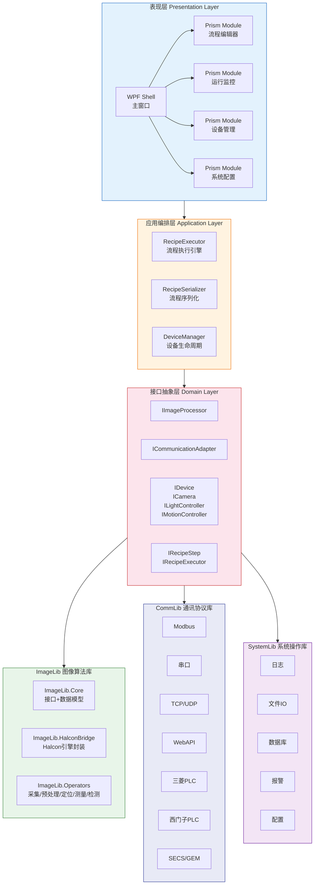

---

## 二、依赖关系图（单向依赖）

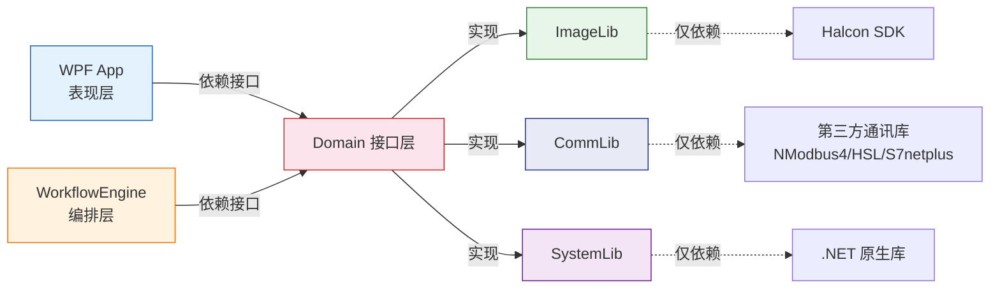

**核心规则：底层库之间零依赖，上层只依赖接口，不依赖实现。**

---

## 三、模块结构树

```
通用视觉检测平台
├── 📁 src/
│   ├── 📁 ImageLib.Core/              ── 图像处理核心接口与数据模型
│   ├── 📁 ImageLib.HalconBridge/      ── Halcon 引擎封装（唯一依赖 Halcon 的模块）
│   ├── 📁 ImageLib.Operators/         ── 图像处理算子实现
│   │   ├── 📁 Acquisition/            ── 采集算子
│   │   ├── 📁 Preprocessing/          ── 预处理（滤波、增强、矫正）
│   │   ├── 📁 Alignment/              ── 定位（模板匹配、边缘定位）
│   │   ├── 📁 Measurement/            ── 测量（卡尺、几何）
│   │   ├── 📁 Inspection/             ── 检测（Blob、缺陷）
│   │   └── 📁 Utility/                ── 工具（格式转换、运算）
│   ├── 📁 CommLib.Core/               ── 通讯核心接口
│   ├── 📁 CommLib.Modbus/             ── Modbus TCP/RTU
│   ├── 📁 CommLib.SerialPort/         ── 串口通讯
│   ├── 📁 CommLib.TcpUdp/             ── TCP/UDP
│   ├── 📁 CommLib.WebApi/             ── REST Client
│   ├── 📁 CommLib.PLC.Mitsubishi/     ── 三菱 PLC
│   ├── 📁 CommLib.PLC.Siemens/        ── 西门子 PLC
│   ├── 📁 CommLib.SecsGem/            ── SECS/GEM
│   ├── 📁 SystemLib.Core/             ── 系统操作核心接口
│   ├── 📁 SystemLib.Services/         ── 系统操作实现
│   ├── 📁 WorkflowEngine.Core/        ── 流程引擎
│   └── 📁 App.Wpf/                    ── WPF 主程序
│       ├── 📁 Bootstrapper/           ── Prism 启动配置
│       ├── 📁 Modules/                ── 功能模块
│       ├── 📁 Views/                  ── 视图
│       ├── 📁 ViewModels/             ── 视图模型
│       └── 📁 Services/               ── 服务
├── 📁 tests/
│   ├── 📁 ImageLib.Tests/
│   ├── 📁 CommLib.Tests/
│   ├── 📁 WorkflowEngine.Tests/
│   └── 📁 SystemLib.Tests/
└── 📁 docs/
    └── 📁 stages/
        ├── 📁 01-项目启动/
        ├── 📁 02-阶段一-地基/
        ├── 📁 03-阶段二-能用/
        ├── 📁 04-阶段三-稳定/
        └── 📁 05-阶段四-扩展/
```

---

## 四、核心接口关系图

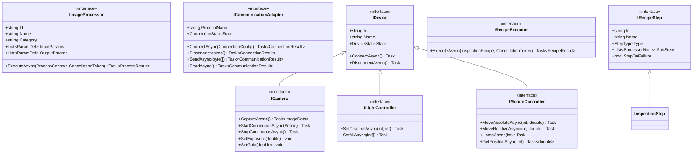

---

## 五、检测流程数据流图

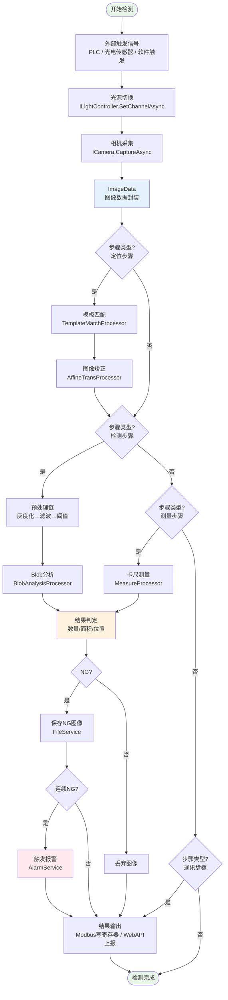

---

## 六、流程引擎执行时序图

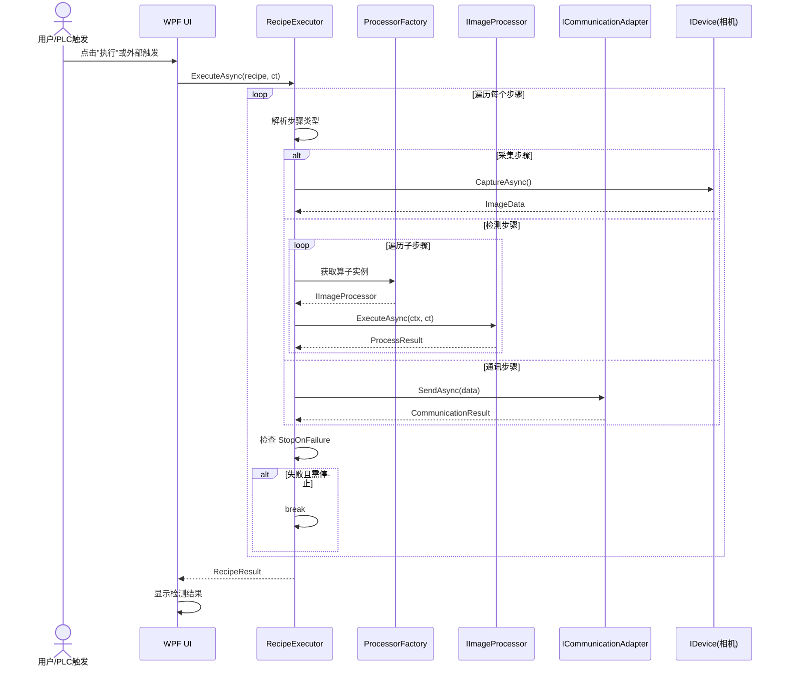

---

## 七、算子生命周期图

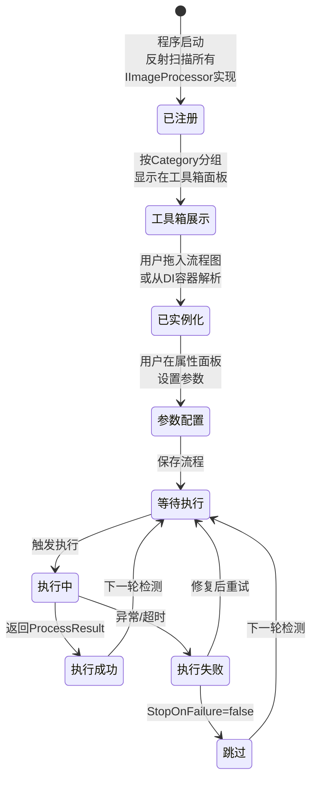

---

## 八、设备连接状态机

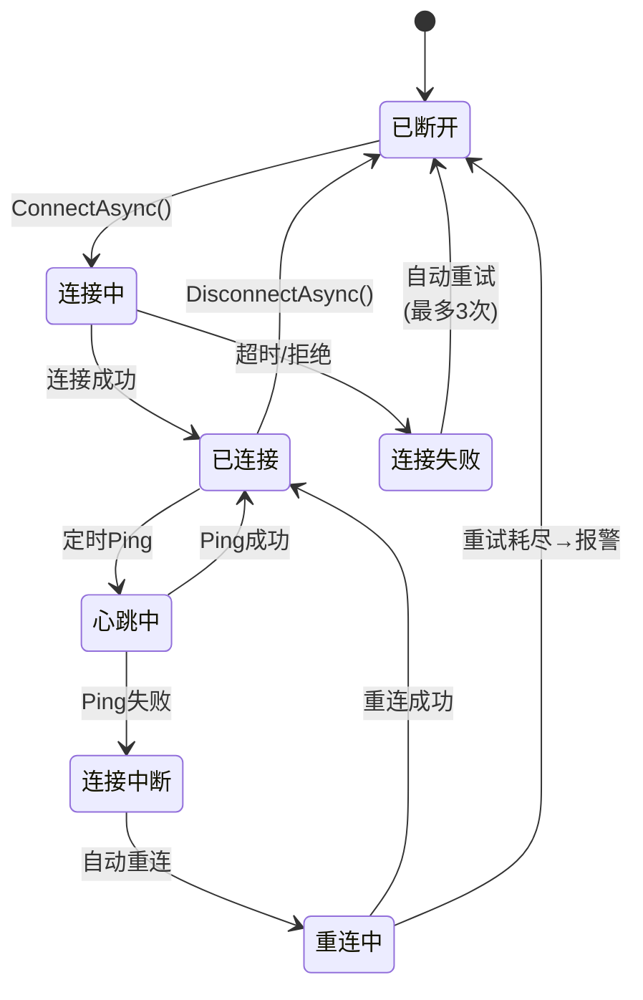

---

## 九、开发路线图（甘特图风格）

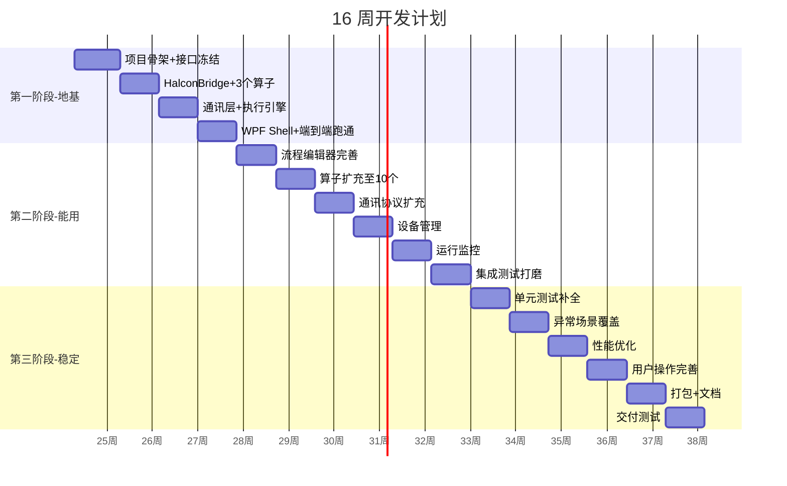

---

## 十、技术栈全景图

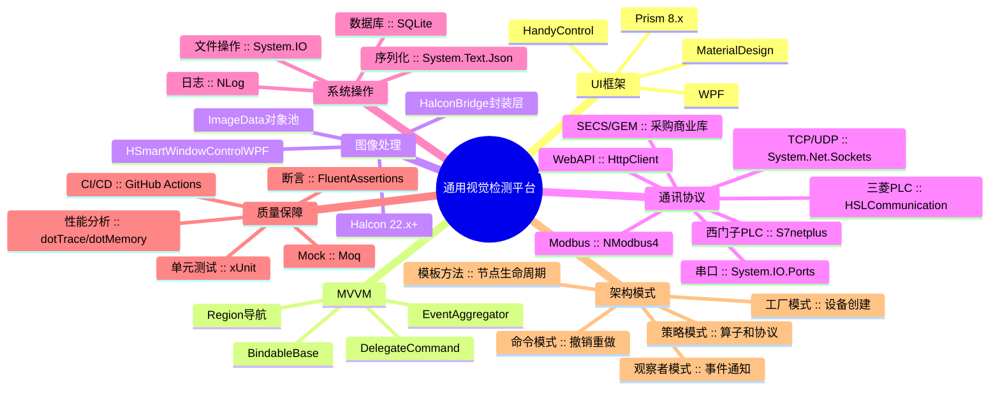

---

## 十一、接口实现映射表

```
接口定义（第一周冻结）              实现（按计划逐步完成）
────────────────────────────────────────────────────────────
IImageProcessor ───────────────┬── BlobAnalysisProcessor       ✅ 第2周
                               ├── GrayScaleProcessor           ✅ 第2周
                               ├── AcquisitionProcessor         ✅ 第2周
                               ├── MeanFilterProcessor          ✅ 第6周
                               ├── MedianFilterProcessor        ✅ 第6周
                               ├── GaussianFilterProcessor      ✅ 第6周
                               ├── TemplateMatchProcessor       ✅ 第6周
                               ├── AffineTransProcessor         ✅ 第6周
                               ├── MeasureProcessor             ✅ 第6周
                               ├── ThresholdJudgeProcessor      ✅ 第6周
                               └── DeepLearningProcessor        ⬜ 需要时

ICommunicationAdapter ──────────┬── SerialPortAdapter           ✅ 第3周
                                ├── ModbusTcpAdapter            ✅ 第3周
                                ├── TcpClientAdapter            ✅ 第7周
                                ├── TcpServerAdapter            ✅ 第7周
                                ├── WebApiAdapter               ✅ 第7周
                                ├── MitsubishiAdapter           ✅ 第7周
                                ├── SiemensAdapter              ⬜ 需要时
                                └── SecsGemAdapter              ⬜ 采购后

ICamera ────────────────────────┬── BaslerCamera                ✅ 第8周
                                ├── HikvisionCamera             ⬜ 需要时
                                └── DalsaCamera                 ⬜ 需要时

ILightController ────────────────── LightController             ✅ 第8周

IMotionController ──────────────── MotionCardController         ⬜ 需要时

✅ = 已实现    ⬜ = 接口已定义，等需要时再实现
```

---

## 十二、V1.0 vs V2.0 vs V3.0 功能演进

```mermaid
graph LR
    subgraph V1["V1.0 基础版 (16周)"]
        V1A["3个核心接口<br/>+ 每个接口1个实现"]
        V1B["10个图像算子"]
        V1C["4种通讯协议<br/>串口/Modbus/TCP/WebAPI"]
        V1D["1种相机 (Basler)"]
        V1E["1种PLC (三菱)"]
        V1F["树形大纲流程编辑器"]
        V1G["顺序执行引擎"]
    end

    subgraph V2["V2.0 增强版"]
        V2A["30+图像算子"]
        V2B["SECS/GEM<br/>GPIB<br/>西门子PLC"]
        V2C["多相机/多品牌"]
        V2D["运动控制卡"]
        V2E["条件分支+并行"]
        V2F["SPC统计分析"]
        V2G["3D视觉"]
    end

    subgraph V3["V3.0 高级版"]
        V3A["深度学习推理"]
        V3B["拖拽流程图"]
        V3C["Web远程监控"]
        V3D["多工位协同"]
        V3E["配方云端管理"]
        V3F["预测性维护"]
    end

    V1 --> V2
    V2 --> V3

    style V1 fill:#e8f5e9,stroke:#2e7d32
    style V2 fill:#fff3e0,stroke:#ef6c00
    style V3 fill:#e3f2fd,stroke:#1565c0
```

---

## 十三、阶段门禁检查流程

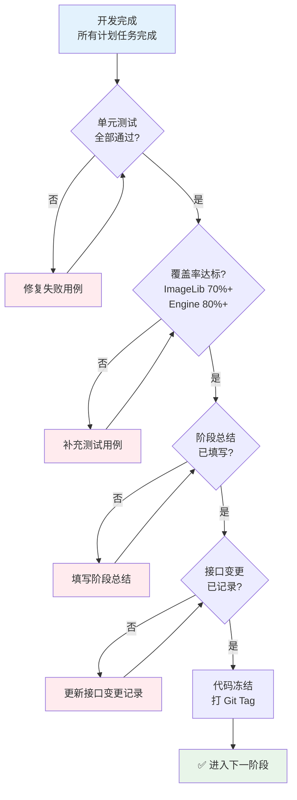

---

## 十四、AI 辅助开发工作流

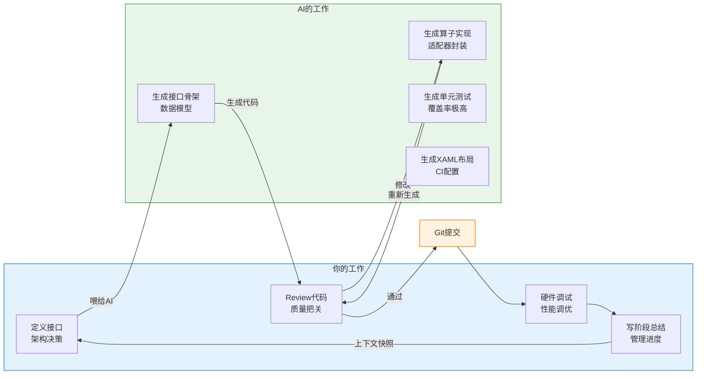

---

## 十五、风险热力图

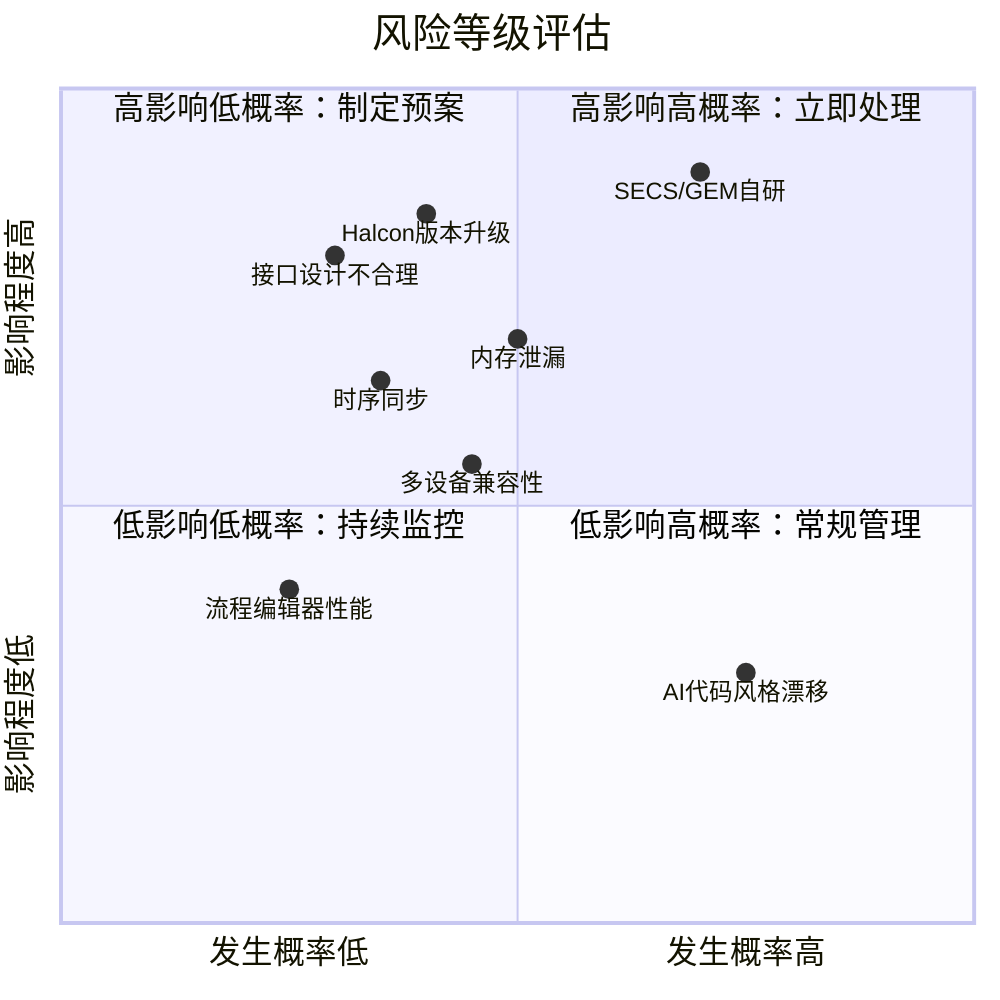

---

## 十六、一句话总结

```
┌─────────────────────────────────────────────────────────────┐
│                                                             │
│  接口层：多留，一个不少   →   扩展性的根基                    │
│  实现层：少做，按需迭代   →   不浪费一行代码                  │
│  AI：做代码生成器         →   架构决策你来做                  │
│  阶段记录：每周必写       →   中断也能接上                    │
│                                                             │
│  不做万能平台，做可扩展框架。                                 │
│  第一个客户要什么，就做什么。                                 │
│                                                             │
└─────────────────────────────────────────────────────────────┘
```

---

*文档结束 — 配合 [软件方案设计书.md](软件方案设计书.md) 阅读*